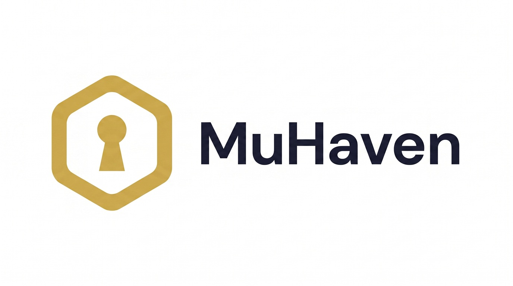
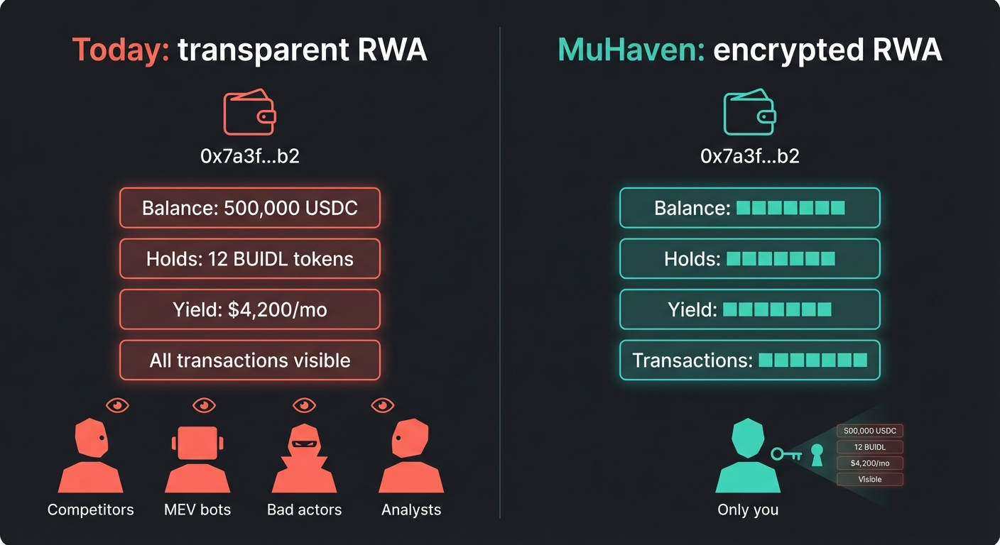
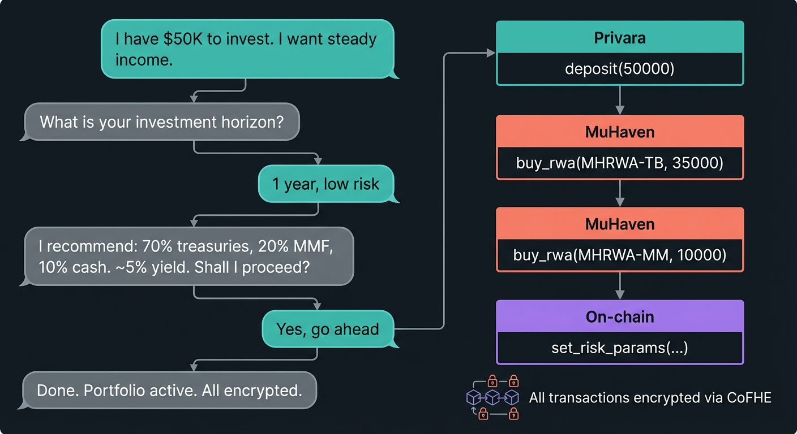
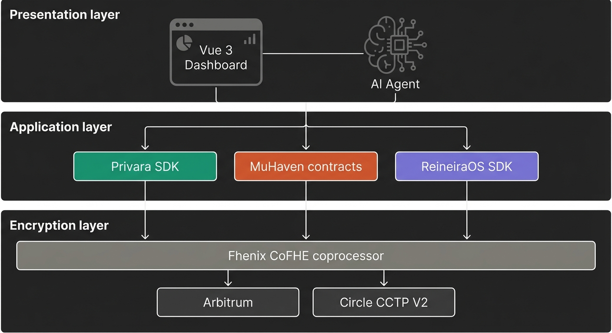
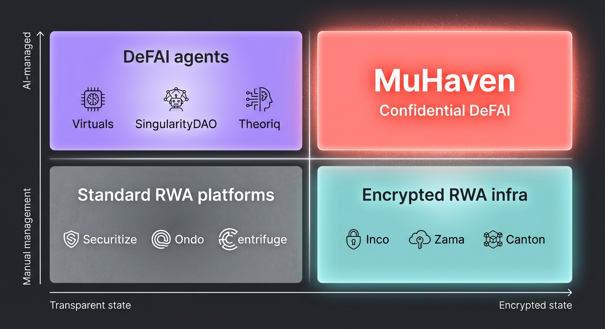

# MuHaven

**The first autonomous RWA portfolio manager where nobody can see your strategy, your balances, or your yields — not even the agent. A two-sided platform: issuers create tokens with confidential distribution, investors manage portfolios with AI-powered privacy.**

---

### Quick navigation

| Document | Description |
|----------|-------------|
| [Architecture](./docs/ARCHITECTURE.md) | System layers, data flow diagrams, integration points |
| [Smart Contracts](./docs/SMART_CONTRACTS.md) | Contract specs, interfaces, Solidity code |
| [AI Agent Design](./docs/AGENT_DESIGN.md) | Agent architecture, tool definitions, implementation guide |
| [Issuer Model](./docs/ISSUER_MODEL.md) | Supply side: how RWA tokens enter MuHaven, yield flow, issuer experience |
| [Competitive Analysis](./docs/COMPETITIVE_ANALYSIS.md) | Market positioning vs. Canton, Silent Data, DeFAI |
| [Testnet Deployment](./docs/TESTNET_DEPLOY.md) | Step-by-step guide: env setup, deploy, verify, test |

---

## The Problem

### Real-World Assets on public blockchains are broken by design

Tokenized Real-World Assets (RWAs) — treasuries, bonds, real estate, private credit — represent a $29B+ on-chain market with 385,000+ asset holders as of late 2025. By 2030, this market is projected to reach $30 trillion.

But every single one of those holders has a critical vulnerability: **their entire financial position is public.**

On any EVM chain, standard ERC-20 tokens expose everything. Balances, transfer amounts, transaction history — all visible to anyone with a block explorer. For tokenized securities, this creates four concrete risks:

1. **Wealth profiling** — Once a wallet is linked to an identity (through KYC onboarding or on-chain analytics), anyone can estimate an investor's net worth and portfolio composition.

2. **Strategy leakage** — Competitors and MEV bots can observe accumulation patterns, rebalancing activity, and yield claiming behavior in real time.

3. **Yield inference** — Even if balances were hidden, yield distributions (bond coupons, dividends, rental income) broadcast position sizes by implication. If someone receives $4,200/month from a 6% fund, they hold ~$840,000.

4. **Physical security risk** — Large on-chain balances tied to real identities through KYC create targets for social engineering and physical threats.



### Why existing solutions fail

| Approach | Examples | What it does | What it can't do |
|----------|----------|-------------|------------------|
| **Permissioned chains** | Canton Network, Silent Data L2 | Restricts who can see data | Kills composability — no DeFi integration |
| **ZK identity** | zkMe, Polygon ID | Proves credentials privately | Can't encrypt ongoing balances or compute on them |
| **Mixers** | Tornado Cash model | Hides transaction graph | Regulatory poison for securities; no balance privacy |
| **Off-chain state** | Most current RWA platforms | Keeps data in traditional databases | Defeats the purpose of blockchain entirely |

The root issue: **RWA privacy isn't a verification problem (which ZK solves) — it's a persistent encrypted state problem.** You need balances, yields, and eligibility to remain encrypted on-chain as live, computable values that smart contracts operate on continuously.

### The DeFAI blind spot

The DeFAI (DeFi + AI) market is exploding — AI agents that manage portfolios, optimize yields, and execute trades autonomously. But every existing DeFAI agent operates on **transparent state**. When an AI agent rebalances a portfolio, the entire strategy is visible on-chain. Competitors copy it. MEV bots front-run it. The agent's edge evaporates the moment it acts.

---

## The Solution

### MuHaven: Confidential DeFAI for Real-World Assets

MuHaven is the first confidential, AI-powered RWA portfolio manager. It's a **two-sided platform**: issuers create and list RWA tokens, deposit yield, and manage distribution — while investors describe their goals in natural language and the AI agent builds a portfolio, manages it 24/7, and nobody can see the strategy, the balances, or the yields. Not competitors, not MEV bots, not even the agent itself.

**How it works in 30 seconds:**

1. An **issuer** creates a tokenized RWA on MuHaven (or wraps an existing ERC-20 RWA token like BUIDL) and configures yield schedule, KYC requirements, and jurisdiction rules.
2. An **investor** says: *"I have $50K. I want steady income, low risk, 1-year horizon."*
3. The AI agent assesses risk tolerance and recommends an allocation (e.g., 70% tokenized treasuries, 20% money market, 10% cash buffer).
4. The investor approves. The agent deposits via encrypted payment rails, buys fhERC-20 RWA tokens (encrypted balances), and sets up auto-yield claiming.
5. When the issuer deposits yield, MuHaven's YieldDistributor calculates each investor's proportional share using FHE math — the issuer sees aggregates, but never individual positions.
6. Everything is encrypted on-chain. The agent monitors, rebalances, and claims yields — all on encrypted state. Only the investor can decrypt their portfolio.

### Three merged problems, one product

MuHaven solves three RWA issues simultaneously — because solving them separately would be architecturally incomplete:

| Issue | Why it's inseparable | How MuHaven solves it |
|-------|---------------------|----------------------|
| **Balance privacy** | The core problem — holdings visible to everyone | fhERC-20 tokens with FHE-encrypted balances via Fhenix CoFHE |
| **Yield distribution privacy** | Yields leak balance info — breaks balance privacy | Encrypted escrow via ReineiraOS — yields computed and distributed in ciphertext |
| **KYC-gated access** | Securities require investor verification before any transfer | Modular IKYCGate interface — ERC-3643/zkMe now, ReineiraOS compliance when ready |

### The AI agent: three hats, one conversation



The AI agent isn't a chatbot. It's three roles in one:

- **Advisor** — Asks questions, assesses risk tolerance, recommends allocations based on available RWA yields.
- **Risk manager** — Converts investor preferences into on-chain guardrails (max drawdown, min yield threshold, drift tolerance) — all encrypted.
- **Executor** — Deposits, allocates, claims yields, rebalances — all on encrypted state, within bounds the investor approved.

The agent uses a dedicated agent wallet with limited funds (for the hackathon). The investor funds the agent wallet with a capped USDC balance — the agent can only spend what's in that wallet. Session keys (EIP-7702) with scoped, time-limited permissions are planned for production.

---

## Architecture



### System layers

MuHaven is a **two-sided platform** — issuers create and manage RWA tokens on the supply side, investors purchase and manage portfolios on the demand side. Both sides share the same smart contracts.

```
┌───────────────────────────────────────────────────────────────┐
│  ISSUER SIDE (supply)                 INVESTOR SIDE (demand)  │
│                                                               │
│  ┌───────────────────┐                 ┌───────────────────┐  │
│  │ Issuer Dashboard  │                 │ AI Agent + Chat   │  │
│  │ - Create token    │                 │ - Advisory        │  │
│  │ - Deposit yield   │                 │ - Portfolio mgmt  │  │
│  │ - Manage investors│                 │ - Yield claiming  │  │
│  └────────┬──────────┘                 └─────────┬─────────┘  │
│           │                                      │            │
│           ▼                                      ▼            │
│  ┌──────────────────────────────────────────────────────────┐ │
│  │                   MuHaven Contracts                      │ │
│  │                                                          │ │
│  │  MuHavenToken (fhERC-20)  ←──── shared ────→  IKYCGate   │ │
│  │  MuHavenVault (wrap/unwrap)                    YieldGate │ │
│  │  YieldDistributor (proportional escrow creation)         │ │
│  └──────────────────────────────────────────────────────────┘ │
│                              │                                │
│                              ▼                                │
│  ┌──────────────────────────────────────────────────────────┐ │
│  │  ReineiraOS (PUSDC + escrow) + CoFHE (FHE)               │ │
│  └──────────────────────────────────────────────────────────┘ │
└───────────────────────────────────────────────────────────────┘
```

> See [ARCHITECTURE.md](./docs/ARCHITECTURE.md) for detailed technical architecture and data flow diagrams.

### Smart contracts

| Contract | Purpose | Details |
|----------|---------|---------|
| `MuHavenToken.sol` | fhERC-20 RWA token | Encrypted balances (`euint128`), encrypted transfers, async decrypt balance viewing, `onlyMinter` access control |
| `MuHavenVault.sol` | Wrap/unwrap existing ERC-20 RWAs | Lock external ERC-20 (e.g., BUIDL), mint fhERC-20 wrapper; per-user locked balance tracking; burn to unwrap |
| `InvestorRegistry.sol` | Investor address registry | Tracks all token holders; paginated reads; used by YieldDistributor for batch iteration |
| `YieldDistributor.sol` | Proportional yield escrow creation | Batched push model (`startDistribution` + `processBatch`); creates ReineiraOS escrows proportionally |
| `interfaces/IKYCGate.sol` | Modular KYC interface | Swappable adapters — ERC-3643, zkMe, future ReineiraOS compliance |
| `ERC3643KYCAdapter.sol` | KYC implementation | Whitelist + accredited investor tiers; structured for ONCHAINID swap |
| `YieldGate.sol` | ReineiraOS gate plugin | `IConditionResolver` — verifies investor KYC + token balance eligibility for yield settlement |
| `RiskParams.sol` | Encrypted risk guardrails | Stores investor risk preferences (`euint64`) — max drawdown, min yield, drift tolerance, max daily spend |

> See [SMART_CONTRACTS.md](./docs/SMART_CONTRACTS.md) for full contract specifications.

### Deployed contracts (Arbitrum Sepolia)

All contracts are verified on [Arbiscan](https://sepolia.arbiscan.io). Proxied contracts use OpenZeppelin Transparent Proxy.

| Contract | Address | Type |
|----------|---------|------|
| ERC3643KYCAdapter | [`0xdF7Cf475ceC7c6691f6c0776ed6Ed05AAa9bec77`](https://sepolia.arbiscan.io/address/0xdF7Cf475ceC7c6691f6c0776ed6Ed05AAa9bec77) | standalone |
| InvestorRegistry | [`0x189D3BF72DB3b6b13E275e9Dce7cAAfFEBEeD40B`](https://sepolia.arbiscan.io/address/0x189D3BF72DB3b6b13E275e9Dce7cAAfFEBEeD40B) | proxy |
| MuHavenToken | [`0x05519F5c6b0b0626ACd5d7099efC91d9D8367c73`](https://sepolia.arbiscan.io/address/0x05519F5c6b0b0626ACd5d7099efC91d9D8367c73) | proxy |
| RiskParams | [`0xE8C2C6a7A60C31f34a7735e70aa3C99eCC2ef145`](https://sepolia.arbiscan.io/address/0xE8C2C6a7A60C31f34a7735e70aa3C99eCC2ef145) | proxy |
| YieldGate | [`0x2de30627Cf17b973A0c1d01cfe665d2954A76B39`](https://sepolia.arbiscan.io/address/0x2de30627Cf17b973A0c1d01cfe665d2954A76B39) | standalone |
| YieldDistributor | [`0x15F7Da3E0CbBEF587314d4a2e73cc81Ead0f3218`](https://sepolia.arbiscan.io/address/0x15F7Da3E0CbBEF587314d4a2e73cc81Ead0f3218) | proxy |
| MuHavenVault | [`0x513A6Fe54c0b640e16d79CC20787421c17b16Db9`](https://sepolia.arbiscan.io/address/0x513A6Fe54c0b640e16d79CC20787421c17b16Db9) | proxy |
| TestTreasury | [`0x580621f5FC5fF3d7912a570839AC1eb55F44a999`](https://sepolia.arbiscan.io/address/0x580621f5FC5fF3d7912a570839AC1eb55F44a999) | standalone (mock ERC-20) |

**External contracts (ReineiraOS on Arb Sepolia):**

| Contract | Address |
|----------|---------|
| Circle USDC | [`0x75faf114eafb1BDbe2F0316DF893fd58CE46AA4d`](https://sepolia.arbiscan.io/address/0x75faf114eafb1BDbe2F0316DF893fd58CE46AA4d) |
| ConfidentialUSDC (PUSDC) | [`0x6b6e6479b8b3237933c3ab9d8be969862d4ed89f`](https://sepolia.arbiscan.io/address/0x6b6e6479b8b3237933c3ab9d8be969862d4ed89f) |
| ConfidentialEscrow | [`0xC4333F84F5034D8691CB95f068def2e3B6DC60Fa`](https://sepolia.arbiscan.io/address/0xC4333F84F5034D8691CB95f068def2e3B6DC60Fa) |
| SimpleCondition | [`0x9817DA50DB5CE4316D2f0fF6bb6DBfe252C29593`](https://sepolia.arbiscan.io/address/0x9817DA50DB5CE4316D2f0fF6bb6DBfe252C29593) |

> Full deployment data: [`deployments/arb-sepolia.json`](./deployments/arb-sepolia.json)

### AI agent tools

The agent interacts with the protocol through defined tools (function calls):

**Investor-facing (portfolio agent):**

| Tool | What it does | SDK | Scope |
|------|-------------|-----|-------|
| `deposit` | Encrypted stablecoin deposit (USDC → PUSDC) | ReineiraOS |
| `withdraw` | Encrypted stablecoin withdrawal (PUSDC → USDC) | ReineiraOS | Roadmap |
| `buy_rwa` | Purchase fhERC-20 RWA tokens | MuHaven Token |
| `sell_rwa` | Sell fhERC-20 RWA tokens | MuHaven Token | Roadmap |
| `claim_yield` | Redeem yield from escrow | ReineiraOS |
| `view_portfolio` | Unseal and display balances (investor only) | CoFHE |
| `get_yields` | Fetch current RWA yield rates | Oracle / API |
| `set_risk_params` | Store encrypted risk guardrails | MuHaven Token | Roadmap |
| `purchase_insurance` | Buy yield delivery coverage | ReineiraOS Insurance | Roadmap |

**Issuer-facing (platform agent — production):**

| Tool | What it does | SDK |
|------|-------------|-----|
| `create_token` | Deploy a new fhERC-20 RWA token with configuration | MuHaven Token |
| `mint_tokens` | Mint tokens to eligible investor addresses via `mint()` (MINTER_ROLE) | MuHaven Token |
| `deposit_yield` | Deposit yield and trigger proportional distribution via YieldDistributor | MuHaven Token |
| `get_issuer_stats` | View aggregate metrics (total supply, investor count, total yield distributed) | MuHaven Token |
| `update_whitelist` | Add/remove investors from eligibility | IKYCGate |

> See [AGENT_DESIGN.md](./docs/AGENT_DESIGN.md) for complete agent architecture and implementation guide.

---

## Privacy Boundary

MuHaven's privacy guarantee is **balance and yield privacy** — not transaction graph privacy. The table below documents exactly what is encrypted vs. public, and why.

| Data | Visibility | Rationale |
|------|-----------|-----------|
| **Investor balances** | **Encrypted** (`euint128`) | Core privacy guarantee. Only the investor can decrypt via EIP-712 permit. |
| **Transfer amounts** | **Encrypted** (`InEuint128`) | Client-encrypts before submission. Calldata contains ciphertext hash + ZK proof, never plaintext. |
| **Yield per investor** | **Encrypted** (`euint128`) | Each investor's share is FHE-encrypted. Investors decrypt their own share via permits. |
| **Total yield deposited** | **Encrypted** (`euint128`) | Encrypted in contract state. Note: the ERC-20 transfer in `startDistribution` is cleartext (known tradeoff — resolved when PUSDC replaces cleartext USDC). |
| **Risk parameters** | **Encrypted** (4x `euint64`) | Investor-encrypted client-side. AI agent decrypts via async decrypt with dynamic `FHE.allow`. |
| **Total supply** | **Encrypted** (default) / **Public** (opt-in) | Issuer can toggle `setTotalSupplyPublic()` — one-way, uses `FHE.allowPublic`. Useful for regulated securities requiring public supply. |
| **Aggregate yield distributed** | **Encrypted** (`euint128`) | Running total across all distributions. Owner can async-decrypt for reporting. |
| Investor addresses | Public | Stored in InvestorRegistry. Addresses are inherently public on EVM (visible in tx calldata). |
| Transfer from/to addresses | Public | Emitted in `Transfer(from, to)` event. No new info leaked — addresses already visible in calldata. |
| KYC eligibility | Public | Boolean per address. Revert on `isEligible()==false` is observable, but no private data leaks. |
| Transaction timing | Public | Block timestamps visible on-chain. |
| Minter/issuer roles | Public | Role assignments emitted in events. |
| Distribution progress | Public | `processedCount`, `escrowsCreated` are cleartext counters for batch progress tracking. |

### Side-channel resistance

All `FHE.select()` operations execute an **identical code path** regardless of the encrypted condition result:

```solidity
// Transfer: same gas cost whether balance is sufficient or not
euint128 transferAmount = FHE.select(hasEnough, amount, zero);
```

An observer watching gas costs or execution traces cannot distinguish a successful transfer from a failed (zero-amount) one. This is the "silent failure" pattern applied consistently across `MuHavenToken`, `YieldDistributor`, and `MuHavenVault`.

### FHE operations used

| Operation | Where | Purpose |
|-----------|-------|---------|
| `FHE.asEuint128(InEuint128)` | Token, Vault | Convert client-encrypted input to on-chain ciphertext |
| `FHE.asEuint128(uint256)` | Token, Vault, YieldDistributor | Trivial encrypt cleartext for on-chain computation |
| `FHE.add` | Token, YieldDistributor | Balance increment, yield accumulation |
| `FHE.sub` | Token | Balance decrement |
| `FHE.div` | YieldDistributor | Per-investor yield = total / count |
| `FHE.gte` | Token | Balance sufficiency check (returns `ebool`) |
| `FHE.select` | Token | Silent failure — conditional zero on insufficient balance |
| `FHE.allow(ct, address)` | Token, YieldDistributor, RiskParams | Grant permit-based `decryptForView` to specific address |
| `FHE.allowThis` | All contracts | Contract retains access to its own ciphertext handles |
| `FHE.allowSender` | RiskParams | Investor retains read access to own risk params |
| `FHE.allowPublic` | Token | Optional public total supply via threshold decryption |
| `Common.isInitialized` | Token, YieldGate | Guard against FHE ops on uninitialized (zero-hash) ciphertext |
| `ITaskManager.createDecryptTask` | Token, RiskParams, YieldDistributor | Async decrypt for on-chain result reading |
| `FHE.getDecryptResultSafe` | Token, RiskParams, YieldDistributor | Read async-decrypted plaintext result |

> Full threat model: [THREAT_MODEL.md](./docs/THREAT_MODEL.md)

---

## Why Fhenix + ReineiraOS

### Why FHE, not just ZK?

| Capability | ZK proofs | FHE (Fhenix) |
|-----------|-----------|---------------|
| Prove a fact without revealing it | Yes | Yes |
| Encrypt balances as persistent on-chain state | No | **Yes** |
| Compute on encrypted data (transfers, yields) | No | **Yes** |
| Ongoing encrypted state management | No | **Yes** |
| Binary verification (accredited? yes/no) | Yes | Yes |
| Tiered computation (which tranche? how much yield?) | No | **Yes** |

ZK proves things about data. FHE computes on data. RWAs need ongoing computation on sensitive state — that's the whitespace FHE fills.

### Why Fhenix specifically?

- **CoFHE coprocessor** — Offloads heavy FHE computation off-chain, verified on-chain. 50x faster decryption than competitors.
- **fhERC-20 standard** — Production-ready encrypted token standard with encrypted balances and transfers.
- **Solidity-native** — Standard Solidity + Hardhat workflow. Import the library, use encrypted types. No new language.
- **Live on Arbitrum** — CoFHE is deployed on Arbitrum, not just testnet.
- **Quantum-resistant** — Lattice-based cryptography, resistant to quantum attacks.

### Why ReineiraOS?

ReineiraOS is programmable infrastructure for stablecoins, built on Arbitrum and powered by Fhenix FHE. MuHaven uses ReineiraOS directly (not via Privara, which is ReineiraOS's consumer app layer) through the Platform Modules starter kit.

- **Confidential stablecoin (PUSDC)** — FHE-encrypted wrapper around USDC/USDT. Deposits and withdrawals don't expose amounts on-chain. Replaces cleartext ERC-20 transfers in the yield pipeline.
- **Encrypted conditional escrow** — Holds yield in FHE-encrypted state, releases when cryptographic conditions are met.
- **Gate plugin system** — MuHaven deploys an `IConditionResolver` (YieldGate) for yield eligibility checks.
- **Insurance pools** — Encrypted risk scoring and coverage for yield delivery failures.
- **Cross-chain settlement** — Circle CCTP V2 integration for native USDC transfers across chains.
- **Platform Modules** — Plug-and-play backend (Clean Architecture, DB-agnostic) and app starter (ZeroDev smart accounts, passkey auth) for ventures building on ReineiraOS.
- **Same CoFHE coprocessor** — Zero integration friction with MuHaven's token contracts.

---

## Competitive Positioning

### The "Confidential DeFAI" quadrant — MuHaven is alone here



|  | Transparent state | Encrypted state |
|--|-------------------|-----------------|
| **AI-managed** | Virtuals, SingularityDAO, Theoriq | **MuHaven** (only player) |
| **Manual** | Securitize, Ondo, Centrifuge | Canton, Silent Data, Inco/Zama |

Every existing DeFAI agent operates on transparent state — strategies are visible and exploitable. Every existing privacy solution is manual — no AI portfolio management. MuHaven is the only product that combines both.

> Full competitive breakdown: [COMPETITIVE_ANALYSIS.md](./docs/COMPETITIVE_ANALYSIS.md)

### MuHaven vs. the landscape

| Feature | Permissioned chains (Canton, Silent Data) | ZK identity (zkMe, Polygon ID) | Existing DeFAI (Virtuals, SingularityDAO) | **MuHaven** |
|---------|------------------------------------------|-------------------------------|------------------------------------------|-------------|
| Balance privacy | Via access control | No | No | **FHE-encrypted on-chain** |
| Yield privacy | Via access control | No | No | **Encrypted escrow** |
| Issuer sees individual positions | Yes | N/A | N/A | **No — only aggregates** |
| Token issuance (native + wrapped) | Custom | No | No | **Yes (fhERC-20 + vault wrapper)** |
| DeFi composability | No (siloed) | Yes | Yes | **Yes** |
| AI portfolio management | No | No | Yes (transparent) | **Yes (encrypted)** |
| Compliance-ready | Yes | Yes | No | **Yes (modular gate)** |
| Cross-chain | Limited | Yes | Varies | **Yes (CCTP V2)** |
| MEV protection | Via permissioning | No | No | **Structural (encrypted state)** |

---

## Market opportunity

### The numbers

| Metric | Value | Source |
|--------|-------|--------|
| Tokenized RWAs on-chain | **$29B+** (Sep 2025) | RWA.xyz |
| On-chain RWA holders | **385,000+** | RWA.xyz |
| Projected RWA market (2030) | **$30 trillion** | Security Token Market |
| Tokenized US Treasuries | **$7.4B** (mid-2025, +80% YTD) | Zoniqx |
| Private DeFi channels Q3 2025 | **$2.3B** | Fhenix research |
| DeFAI market projection (2034) | **$47B** (28.9% CAGR) | CV VC |
| Fortune 500 using AI agents | **80%** (Feb 2026) | Microsoft |

### Consumer market (end-user investors)

- **385,000+ on-chain RWA holders** today — every one has publicly exposed balances.
- **$29B+ tokenized RWAs** on-chain as of September 2025, projected to reach $600B by end of 2025.
- **$2.3B in private DeFi channels** in Q3 2025 alone — institutional traders already seeking confidential execution.
- **DeFAI market** projected to reach $47B by 2034, growing at 28.9% CAGR.

### Business market (RWA issuers and platforms)

- **274 RWA issuers** actively tokenizing assets — each needs a privacy layer for institutional adoption.
- **Tokenized treasuries** alone surpassed $7.4B by mid-2025, up 80% year-to-date.
- **Major institutions** (BlackRock BUIDL, Franklin Templeton BENJI, JPMorgan) all cite confidentiality as a prerequisite for scaling.
- MuHaven's **issuer model** supports both wrapped tokens (existing ERC-20 RWAs) and native issuance — see [ISSUER_MODEL.md](./docs/ISSUER_MODEL.md) for the full supply-side design.

### Why now?

- Fhenix CoFHE is live on Arbitrum (infrastructure exists).
- ERC-3643 was presented to the SEC Crypto Task Force (regulatory alignment).
- 80% of Fortune 500 now deploy active AI agents (agentic AI is mainstream).
- x402 payment protocol launched (agent-to-agent payments are real).

---

### Post-hackathon roadmap

- Advanced agent capabilities (rebalancing, auto-reinvest, insurance purchasing)
- Agent-to-agent coordination (x402 payments, ERC-8004 identity) — hackathon uses direct SDK calls; agent-to-agent is a production enhancement
- Native token issuance via issuer dashboard (production issuer model)
- Revenue model activation: wrapping fee (0.1%), issuance fee (0.2%), yield distribution fee (0.1%) — see [ISSUER_MODEL.md](./docs/ISSUER_MODEL.md)
- ReineiraOS compliance integration (when OFAC/KYT features ship)
- Multi-chain expansion beyond Arbitrum
- Production security audit
- Mainnet deployment

---

## Tech Stack

| Layer | Technology | Version  |
|-------|-----------|----------|
| Blockchain | Arbitrum Sepolia (testnet) → Arbitrum One (production) | —        |
| FHE contracts | `@fhenixprotocol/cofhe-contracts` | `v0.1.3` |
| FHE client SDK | `@cofhe/sdk` + `@cofhe/hardhat-plugin` + `@cofhe/mock-contracts` | `v0.4.0` |
| Dev starter | `cofhe-hardhat-starter` (branch: `sdk-migration`) | —        |
| Token standard | FHERC-20 (max type: `euint128`) | —        |
| KYC framework | ERC-3643 / ONCHAINID (swappable via IKYCGate) | —        |
| Payments + Escrow | ReineiraOS (PUSDC confidential stablecoin + escrow settlement) | v0.1     |
| Backend | Platform Modules (Clean Architecture, ZeroDev, passkey auth) | v0.1     |
| Cross-chain | Circle CCTP V2 (via ReineiraOS operators) | —        |
| Frontend | Vue 3 + Vite + Tailwind CSS v4 + pnpm | —        |
| AI agent | LLM (Claude/OpenAI) + function calling | —        |
| Package manager | pnpm (Fhenix recommended) | v9+      |

> **SDK stability warning**: Fhenix `cofhe-contracts` is under active development. The team warns it "will be changing frequently." MuHaven contracts are built against `v0.1.3` with `@cofhe/sdk v0.4.0`. Check [compatibility docs](https://cofhe-docs.fhenix.zone/get-started/introduction/compatibility) before updating. See [SMART_CONTRACTS.md](./docs/SMART_CONTRACTS.md) for a checklist of what to verify if the SDK updates.

---

## Getting Started

### Prerequisites

- Node.js 20+
- pnpm (`npm install -g pnpm`)
- Funded wallet on Arbitrum Sepolia

### Setup (from Fhenix starter)

MuHaven is built on top of `cofhe-hardhat-starter` (branch: `sdk-migration`):

```bash
# Clone the Fhenix starter as your base
git clone -b sdk-migration https://github.com/FhenixProtocol/cofhe-hardhat-starter.git muhaven
cd muhaven
pnpm install
```

### Environment variables

Create a `.env` file from the example:

```bash
cp .env.example .env
```

Required variables:

```bash
# Wallet & chain
PRIVATE_KEY=                  # Deployer wallet private key
ARB_SEPOLIA_RPC_URL=          # Arbitrum Sepolia RPC URL

# API keys
FHENIX_API_KEY=               # Fhenix CoFHE API key
REINEIRA_API_KEY=             # ReineiraOS key
ETHERSCAN_API_KEY=            # For contract verification
ARBISCAN_API_KEY=             # For contract verification

# Deploy script variables (testnet only — local uses auto-deployed mocks)
ISSUER_ADDRESS=               # Address to grant minter + distribution rights (default: deployer)
USDC_ADDRESS=                 # Stablecoin address passed to MuHavenToken (default: zero)
UNDERLYING_TOKEN_ADDRESS=     # ERC-20 RWA token address for MuHavenVault (required on testnet)
REINEIRA_ESCROW_ADDRESS=      # Deployed ReineiraOS escrow address (required on testnet)
```

### Run tests

```bash
pnpm test
```

### Deploy to testnet

```bash
pnpm run deploy:testnet
```

### Run the frontend

```bash
cd frontend
bun install
bun run dev          # Dev server at http://localhost:7778
```

---

## Project Structure

```
muhaven/
├── README.md                    # This file
├── docs/
│   ├── ARCHITECTURE.md          # Technical architecture
│   ├── SMART_CONTRACTS.md       # Contract specifications
│   ├── AGENT_DESIGN.md          # AI agent implementation guide
│   ├── ISSUER_MODEL.md          # Supply side: issuer model, yield flow, dashboard
│   ├── COMPETITIVE_ANALYSIS.md  # Market positioning
├── contracts/
│   ├── MuHavenToken.sol         # fhERC-20 RWA token
│   ├── MuHavenVault.sol         # Wrap/unwrap ERC-20 ↔ fhERC-20
│   ├── InvestorRegistry.sol     # Investor address registry
│   ├── ERC3643KYCAdapter.sol    # ERC-3643 KYC adapter (whitelist + accredited)
│   ├── YieldDistributor.sol     # Batched proportional yield escrow creation
│   ├── YieldGate.sol            # ReineiraOS condition resolver
│   ├── RiskParams.sol           # Encrypted investor risk guardrails
│   ├── interfaces/
│   │   ├── IKYCGate.sol         # Swappable KYC gate interface
│   │   ├── IMuHavenToken.sol
│   │   ├── IInvestorRegistry.sol
│   │   ├── IYieldDistributor.sol
│   │   └── IReineiraEscrow.sol
│   └── mocks/
│       ├── TestTreasury.sol     # Mock ERC-20 for local vault testing
│       └── MockReineiraEscrow.sol
├── test/
│   ├── MuHavenToken.test.ts
│   ├── AccessControl.test.ts
│   ├── InvestorRegistry.test.ts
│   ├── KYCGate.test.ts
│   ├── MuHavenVault.test.ts
│   ├── RiskParams.test.ts
│   ├── YieldDistribution.test.ts
│   ├── VaultInvariant.test.ts
│   ├── RegistryInvariant.test.ts
│   └── helpers/setup.ts         # Shared fixtures + CoFHE client helpers
├── scripts/
│   ├── deploy.ts                # Full deployment (all 9 contracts, local + testnet)
│   └── deploy-mocks.ts          # Standalone TestTreasury deploy utility
├── deployments/                 # Saved deployment addresses (JSON, gitignored for localcofhe)
├── frontend/
│   ├── src/
│   │   ├── views/
│   │   │   ├── investor/        # Investor dashboard pages
│   │   │   └── issuer/          # Issuer dashboard pages
│   │   └── ...
│   └── ...                      # Vue 3 application
├── agent/
│   └── ...                      # AI agent implementation (Wave 3)
└── hardhat.config.ts
```

---

## Links

- **Fhenix**: [fhenix.io](https://www.fhenix.io/) | [CoFHE Docs](https://cofhe-docs.fhenix.zone/)
- **CoFHE repos**: [cofhe-contracts](https://github.com/FhenixProtocol/cofhe-contracts) | [@cofhe/sdk](https://github.com/FhenixProtocol/cofhesdk) | [cofhe-hardhat-starter](https://github.com/FhenixProtocol/cofhe-hardhat-starter)
- **ReineiraOS**: [Docs](https://docs.reineira.xyz/) | [Platform Modules](https://github.com/ReineiraOS/platform-modules) | [reineira-code](https://github.com/ReineiraOS/reineira-code)
- **ERC-3643**: [erc3643.org](https://www.erc3643.org/) | [GitHub](https://github.com/ERC-3643/ERC-3643)

---

## License

MIT

---

*Built with Fhenix FHE. Privacy is not a feature — it's the architecture.*
