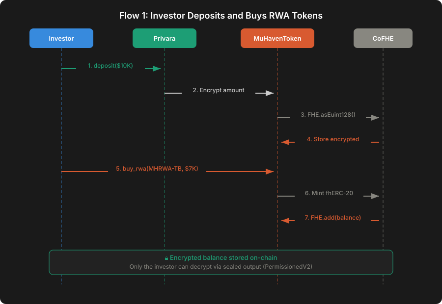
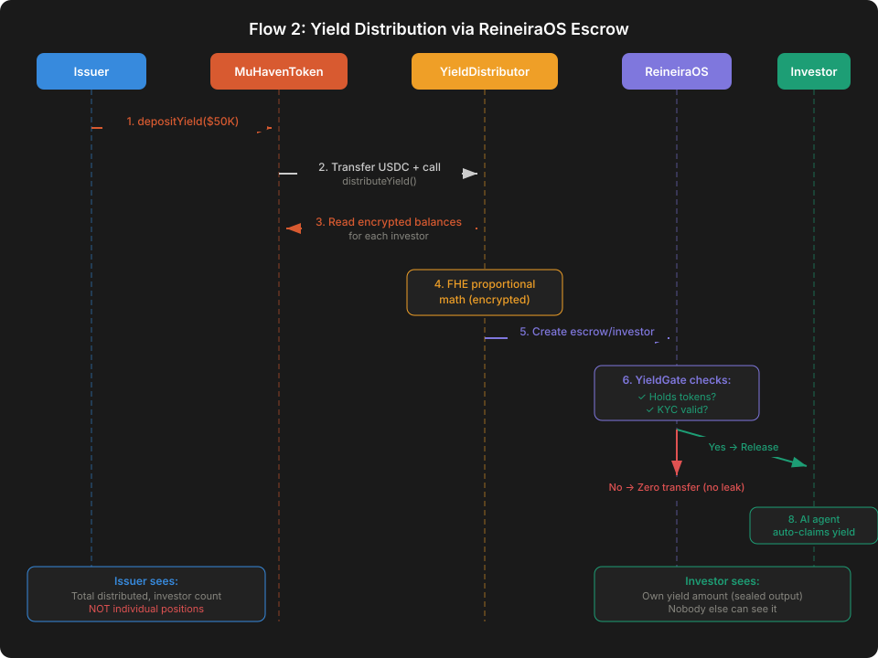
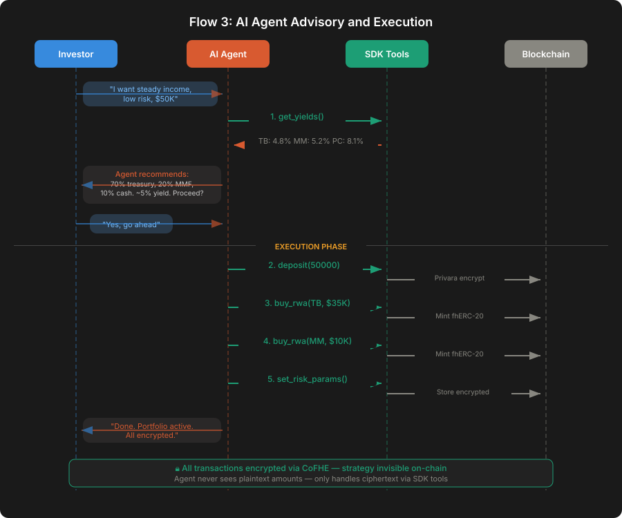
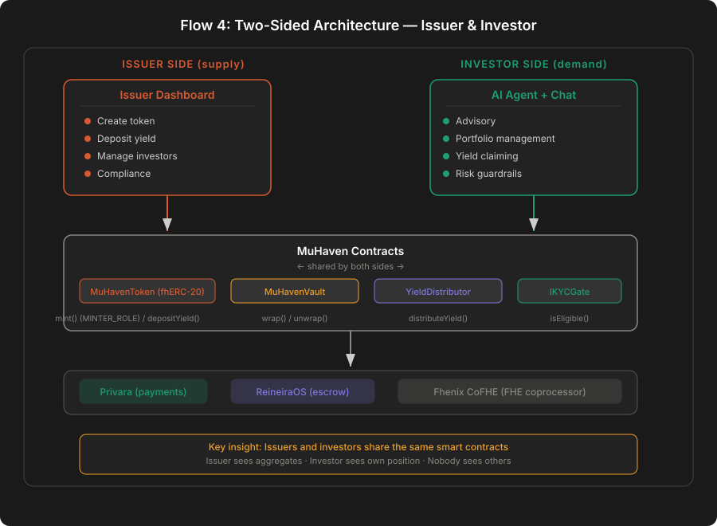

# MuHaven — Technical Architecture

> System layers, data flow, integration points, and security model.

---

## Overview

MuHaven is a **two-sided** three-layer system: an **fhERC-20 token layer** (encrypted RWA balances), a **settlement layer** (encrypted yield distribution via `MuHavenEscrow` on top of ReineiraOS PUSDC), and an **AI agent layer** (autonomous portfolio management on encrypted state — scaffolded in the current hackathon build, full execution loop is Wave 4). All three layers share the Fhenix CoFHE coprocessor for fully homomorphic encryption.

The **supply side** (issuers) creates and manages RWA tokens, deposits yield, and manages investor eligibility. The **demand side** (investors) purchases tokens, receives yield, and uses AI-powered portfolio management. Both sides share the same smart contracts but interact through different interfaces.

In Wave 3 the frontend talks to an **application backend** (Docker stack on a homelab, exposed via Cloudflare tunnel) that provides SIWE+passkey auth, portfolio/yield aggregation, and a block poller that tracks distribution state. A separate **FHE worker** service wraps `@cofhe/sdk/node` so server-side encryption (needed for agent flows) is isolated from the API pod. See [BACKEND_SETUP.md](./BACKEND_SETUP.md) for the full service topology.

---

## System layers

```
┌──────────────────────────────────────────────────────────────────┐
│  PRESENTATION LAYER                                              │
│                                                                  │
│  ┌─────────────────────┐     ┌──────────────────────────────┐    │
│  │  Vue 3 Dashboard    │     │  AI Agent (LLM + tools)      │    │
│  │  - Portfolio view   │     │  - Natural language intent   │    │
│  │  - Deposit/withdraw │     │  - Strategy recommendation   │    │
│  │  - Yield tracking   │     │  - Autonomous execution      │    │
│  └─────────┬───────────┘     └──────────────┬───────────────┘    │
│            │                                │                    │
│  ┌─────────┴────────────┐                   │                    │
│  │ Issuer Dashboard     │                   │                    │
│  │ - Token management   │                   │                    │
│  │ - Yield distribution │                   │                    │
│  │ - Investor mgmt      │                   │                    │
│  │ - Compliance         │                   │                    │
│  └─────────┬────────────┘                   │                    │
│            └─────────────┬──────────────────┘                    │
└──────────────────────────┼───────────────────────────────────────┘
                           │
┌──────────────────────────▼──────────────────────────────────────────────┐
│  APPLICATION LAYER                                                      │
│                                                                         │
│  ┌──────────────────────┐  ┌─────────────────────┐  ┌────────────────────────┐  │
│  │ ReineiraOS SDK       │  │ MuHaven             │  │ ReineiraOS Escrow      │  │
│  │                      │  │ Contracts           │  │                        │  │
│  │ - pusdc.wrap()       │  │                     │  │ - escrow.create()      │  │
│  │ - pusdc.unwrap()     │  │ - transfer()        │  │ - escrow.redeem()      │  │
│  │ - stablecoin()       │  │ - mint()            │  │ - insurance.purchase() │  │
│  │                      │  │ - depositYield()    │  │                        │  │
│  │                      │  │ - balanceOfSealed() │  │                        │  │
│  └──────────┬───────────┘  └──────┬──────────────┘  └──────────┬─────────────┘  │
│         │                 │                            │                │
│         │         ┌───────┴────────┐                   │                │
│         │         │ MuHavenVault   │                   │                │
│         │         │ - wrap()       │                   │                │
│         │         │ - unwrap()     │                   │                │
│         │         └───────┬────────┘                   │                │
│         │                 │                            │                │
│         │         ┌───────┴─────────────┐              │                │
│         │         │ YieldDistributor    │              │                │
│         │         │ - distributeYield() │              │                │
│         │         └───────┬─────────────┘              │                │
│         │                 │                            │                │
└─────────┴─────────────────┴────────────────────────────┴────────────────┘
          │                 │                            │
┌─────────▼─────────────────▼────────────────────────────▼───────────────────────────────┐
│  ENCRYPTION LAYER                                                                      │
│                                                                                        │
│  ┌──────────────────────────────────────────────────────────────────────────────────┐  │
│  │  Fhenix CoFHE Coprocessor                                                        │  │
│  │                                                                                  │  │
│  │  - Encrypted types: euint8, euint16, euint32, euint64, euint128, eaddress, ebool │  │
│  │  - Operations: add, sub, mul, comparison on ciphertext                           │  │
│  │  - Threshold decryption: only authorized parties can decrypt                     │  │
│  │  - 50x faster than competing FHE implementations                                 │  │
│  └──────────────────────────────────────────────────────────────────────────────────┘  │
│                                                                                        │
│  ┌─────────────────────┐  ┌────────────────────────────────────┐                       │
│  │  Arbitrum Sepolia   │  │  Circle CCTP V2                    │                       │
│  │  (EVM execution)    │  │  (Cross-chain USDC settlement)     │                       │
│  └─────────────────────┘  └────────────────────────────────────┘                       │
└────────────────────────────────────────────────────────────────────────────────────────┘
```


---

## Contract architecture

### Contract dependency graph

Eight contracts on Arb Sepolia (six proxied, two standalone). Full table with current addresses in [`deployments/arb-sepolia.json`](../deployments/arb-sepolia.json).

```
MuHavenToken (fhERC-20, proxy)
│
├── imports: @fhenixprotocol/cofhe-contracts/FHE.sol (euint128 max)
├── roles:   owner, issuer, minters (MINTER_ROLE)
├── uses:    IKYCGate → ERC3643KYCAdapter (whitelist for hackathon,
│                                         ONCHAINID claim lookup in production)
├── writes:  InvestorRegistry.addInvestor() on first mint() to a new address
└── held by: MuHavenVault (wrap flow), issuer (direct mint)

InvestorRegistry (proxy)
└── written by MuHavenToken; iterated by SDK + YieldDistributor in pages

MuHavenVault (proxy)
├── locks external ERC-20 RWA (BUIDL, OUSG, TestTreasury in dev)
├── has MINTER_ROLE on MuHavenToken → mints fhERC-20 wrapper 1:1
└── unwrap burns fhERC-20 and releases underlying

YieldDistributor (proxy)
├── driven by the issuer (startDistribution) via SDK
├── pulls PUSDC (ReineiraOS confidential stablecoin) — encrypted amount
├── reads InvestorRegistry + MuHavenToken encrypted balances
└── calls MuHavenEscrow.batchCreate + fundFrom in paginated batches

MuHavenEscrow (proxy — Wave 3)
├── encrypted owner (eaddress), payout (euint64), redeemed flag (ebool)
├── resolver = YieldGate (IConditionResolver: canRedeem + onConditionSet)
├── investor redeem() silently nullifies on wrong caller / resolver denial
└── pays out PUSDC via low-level call (euint64 selector workaround)

YieldGate (standalone)
├── IConditionResolver implementation
├── onConditionSet(id, data) caches plaintext beneficiary off-chain-state
└── canRedeem(id) checks KYC + token balance > 0

RiskParams (proxy)
└── stores 4x euint64 guardrails per investor; FHE.allow(owner) after writes

ERC3643KYCAdapter (standalone)
└── whitelist (hackathon) / ONCHAINID claim lookup (production)
```

### Core contract: MuHavenToken.sol

```solidity
// Simplified — see SMART_CONTRACTS.md for full spec
contract MuHavenToken {
    mapping(address => euint128) private _encryptedBalances;
    euint128 private _encryptedTotalSupply;

    IKYCGate public kycGate;
    IInvestorRegistry public registry;
    mapping(address => bool) public minters;
    address public owner;
    address public issuer;

    modifier onlyMinter() { require(minters[msg.sender], "Only minter"); _; }

    // Mint — granted to issuer + MuHavenVault via MINTER_ROLE
    function mint(address to, InEuint128 calldata encryptedAmount) external onlyMinter {
        require(kycGate.isEligible(to), "KYC: not eligible");
        euint128 amount = FHE.asEuint128(encryptedAmount);
        _encryptedBalances[to] = FHE.add(_encryptedBalances[to], amount);
        FHE.allowThis(_encryptedBalances[to]);
        FHE.allow(_encryptedBalances[to], to);   // permit for client decryptForView
        if (!registry.isInvestor(to)) registry.addInvestor(to);
        emit Transfer(address(0), to);
    }

    // Read (off-chain): client fetches handle, decrypts via permit — no seal-output
    function encryptedBalanceOf(address account) external view returns (euint128);
}
```

Client reads use `cofheClient.decryptForView(ctHash).withPermit().execute()` — the older `sealOutput` / `balanceOfSealed` pattern is removed in cofhe-contracts v0.1.3. See [SMART_CONTRACTS.md § Reading balance](./SMART_CONTRACTS.md#reading-balance-client-side-with-cofhesdk) for the full pattern.

---

## Data flow

### Flow 1: Investor deposits and buys RWA tokens



### Flow 2: Yield distribution via ReineiraOS escrow



### Flow 3: AI agent advisory and execution



### Flow 4: Issuer creates token and distributes yield



**Issuer yield deposit flow (step by step):**

1. Issuer opens the Issuer Dashboard → selects a token → enters total yield amount (e.g., 50 PUSDC).
2. Frontend calls the MuHaven SDK's `distributeYield(totalYield)`, which orchestrates three sub-steps:
   1. `startDistribution` — encrypts the total, submits to `YieldDistributor`, which pulls PUSDC from the issuer via a confidential transfer.
   2. `createYieldEscrows` — paginates `InvestorRegistry`, batch-encrypts addresses with a shared ZK proof, and calls `MuHavenEscrow.batchCreate` with `YieldGate` as the condition resolver. Returns sequentially-assigned escrow IDs.
   3. `fundEscrows` — loops `YieldDistributor.processBatch`, which computes each investor's encrypted share and funds the corresponding escrow via `fundFrom`.
3. `YieldGate.onConditionSet` caches the plaintext beneficiary (off-chain mapping, not state) so subsequent `canRedeem` checks are cheap.
4. Investor opens the yields page → clicks "Claim" → `MuHavenEscrow.redeem(id)` is sent as a gasless UserOp through their ZeroDev kernel.
5. If the encrypted owner check, not-already-redeemed flag, and resolver check all pass, the escrow silently pays out encrypted PUSDC. Events are emitted unconditionally — the backend block poller verifies the actual PUSDC transfer before marking the yield record claimed.

**Key insight:** Issuers and investors share the same smart contracts and the same SDK. The SDK's pluggable sender pattern (EOA-backed `walletClientToSender` for scripts, ZeroDev kernel sender for the frontend) lets one codebase drive both execution contexts. See [SDK.md](./SDK.md) for the full API.

---

## Integration points

### MuHaven ↔ Fhenix CoFHE

- **What**: All encrypted types (`euint8` through `euint128`, `eaddress`, `ebool`) and FHE operations.
- **How**: Import `@fhenixprotocol/cofhe-contracts/FHE.sol` in Solidity. SDK uses `@cofhe/sdk` for client-side encryption.
- **Where**: Every contract that handles amounts, balances, or sensitive state.

### MuHaven ↔ ReineiraOS

- **What**: PUSDC (ReineiraOS's encrypted USDC wrapper) for deposits/withdrawals + backend Platform Modules scaffolding.
- **How**: Direct contract calls to PUSDC for confidential transfers. Backend structure (Clean Architecture layout, ZeroDev passkey kernel provider, Drizzle repositories) is forked from the ReineiraOS Platform Modules starter and adapted for MuHaven.
- **Where**: Investor deposit/withdrawal, yield funding (`YieldDistributor` → PUSDC → `MuHavenEscrow`), backend auth + worker skeleton.
- **Key integration**: PUSDC replaces cleartext USDC transfers — deposit amounts are encrypted on the wire and at rest.
- **Escrow note**: MuHaven deploys its own `MuHavenEscrow` rather than using ReineiraOS's `ConfidentialEscrow` directly. The deployed ConfidentialUSDC on Arb Sepolia predates `cofhe-contracts` v0.1.0 and uses `euint64 = uint256` at the ABI level, while ReineiraOS's `ConfidentialEscrow` assumes the newer `euint64 = bytes32` selector. `MuHavenEscrow` works around this with a low-level call using the legacy selector, and also adds two-phase (ZK batch) creation tailored to the MuHaven flow. See `development/DEV_WAVE_3/PUSDC_TRANSFER_ISSUE.md`.
- **Privara note**: Privara is ReineiraOS's consumer app layer — MuHaven uses ReineiraOS directly via Platform Modules instead of integrating Privara as an SDK.

### MuHaven ↔ ERC-3643

- **What**: KYC/AML compliance via ONCHAINID and verifiable claims.
- **How**: ERC3643KYCAdapter implements IKYCGate, checks ONCHAINID claims from trusted issuers.
- **Where**: Token transfer hook (`_beforeTokenTransfer`).
- **Swap path**: IKYCGate interface allows hot-swapping to zkMe, ReineiraOS, or any future provider.

---

## Security model

### Trust assumptions

| Component | Trust level | Mitigation |
|-----------|------------|------------|
| Fhenix CoFHE | External dependency — FHE key compromise would expose all encrypted state | Threshold decryption distributes key across multiple parties |
| ReineiraOS (PUSDC) | Non-custodial — PUSDC in smart contract | `MuHavenEscrow` owns its own two-phase escrow logic; only pulls PUSDC via confidential transfers |
| ZeroDev kernel + passkey | User holds their passkey on device (WebAuthn) | Session keys are scoped to the MuHaven contract set and time-limited; invalidated on logout |
| AI Agent (Wave 4) | Scaffolded only — no execution loop shipped yet | See Agent status note below |
| ERC-3643 Claims | Trusted issuers vouch for KYC status | Multiple issuers can be required; issuer registry is on-chain |

### Wallet model (Wave 3, shipped)

Users authenticate with a **passkey** (WebAuthn) attached to a **ZeroDev smart account** (EIP-4337 kernel). All user writes are UserOps signed by the passkey and relayed through ZeroDev's bundler + paymaster. The `frontend/src/providers/zerodev/` layer handles registration, login, and session-key installation.

**Session keys** (`@zerodev/permissions`): after the first passkey sign-in, the frontend installs a session-key validator scoped to a narrow allowlist of function calls on MuHaven contracts, valid for a configurable duration (default 1 hour). Subsequent writes within the session are signed by the session key locally — no passkey prompt. This is the shipped prompt-reduction mechanism; see `development/DEV_WAVE_3/PROMPT_REDUCTION_PLAN.md` for the full design.

**Production upgrade (post-hackathon):** Migrate from ZeroDev's kernel-specific permission system to [EIP-7702](https://eips.ethereum.org/EIPS/eip-7702) native session keys once EIP-7702 finalizes and wallet support lands.

### Agent security model (Wave 4, scaffolded)

> ⚠️ The high-level model below ("agent reuses user's ZeroDev kernel + session keys; never holds a private key") is still correct, but the Wave 4 plan has been expanded post-research (2026-04-27) to four surfaces (HavenBot / `@muhaven/mcp` / OpenClaw skill / hosted checkout `pay.muhaven.app`) with a tiered-autonomy engine (Advisory / Confirm-per-action / Policy-bound) and hybrid encrypted-value-plaintext-rule policy storage. Canonical Wave 4 design is `development/WAVE_PLAN.md` §"Wave 4" + `development/DEV_WAVE_4/PLAN.md`; supporting research at `development/research-docs/WAVE_4_AGENTIC_RESEARCH_RESULT.md`.

The AI agent chat UI is live on the frontend, but the execution loop — the portion that would call SDK methods on behalf of the user — is not wired up in the hackathon build. When it ships (Wave 4), the agent wallet will share the ZeroDev kernel + session-key scaffolding described above:

```
User passkey (WebAuthn, on device)
│
└── Authenticates the ZeroDev kernel account
    │
    ├── Direct user actions: signed by passkey (first op) or session key
    │
    └── Wave 4: delegated agent actions
        ├── Narrower session key scope (e.g., only claim_yield, view_portfolio)
        ├── Shorter expiry (per-conversation, not per-session)
        └── Per-action user confirmation modal for writes, initially
```

The agent never holds a private key — it calls into the SDK through the authenticated session kernel just like the user does. See [AGENT_DESIGN.md](./AGENT_DESIGN.md) for the staged rollout.

---

## Deployment

### Testnet (hackathon)

- **Chain**: Arbitrum Sepolia
- **CoFHE**: Fhenix testnet coprocessor
- **ReineiraOS**: Deployed on Arbitrum Sepolia (live) — PUSDC wrapper + ConfidentialEscrow

### Production (post-hackathon)

- **Chain**: Arbitrum One
- **CoFHE**: Fhenix production coprocessor
- **Audit**: Required before mainnet deployment
- **Timelock**: Admin upgrades with delay + multisig

---

